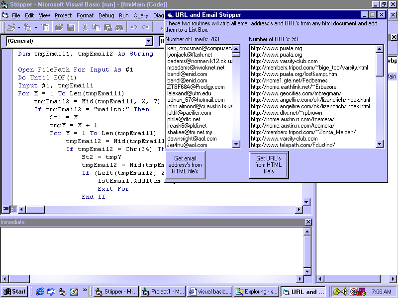



## Email and URL stripper

### Description

This will open any html document and strip out all URL's and Email address and add them to a List Box. I couldn't find any source here that does this, so here you go incase someone out there find it usefull.
 
### More Info
 

             |
---                |---
**Submitted On**   |2001-01-11 07:05:46
**By**             |[CapSoft](https://github.com/Planet-Source-Code/PSCIndex/blob/master/ByAuthor/capsoft.md)
**Level**          |Intermediate
**User Rating**    |4.6 (23 globes from 5 users)
**Compatibility**  |VB 4\.0 \(16\-bit\), VB 4\.0 \(32\-bit\), VB 5\.0, VB 6\.0
**Category**       |[Internet/ HTML](https://github.com/Planet-Source-Code/PSCIndex/blob/master/ByCategory/internet-html__1-34.md)
**World**          |[Visual Basic](https://github.com/Planet-Source-Code/PSCIndex/blob/master/ByWorld/visual-basic.md)
**Archive File**   |[CODE\_UPLOAD136641112001\.zip](https://github.com/Planet-Source-Code/capsoft-email-and-url-stripper__1-14341/archive/master.zip)

